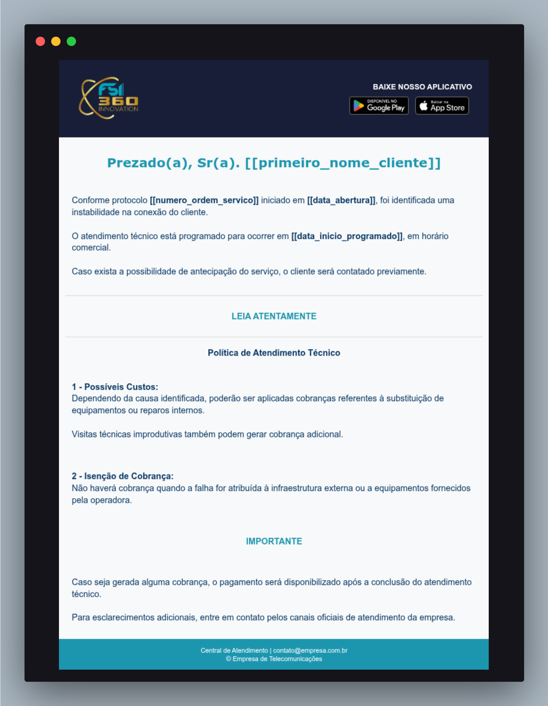
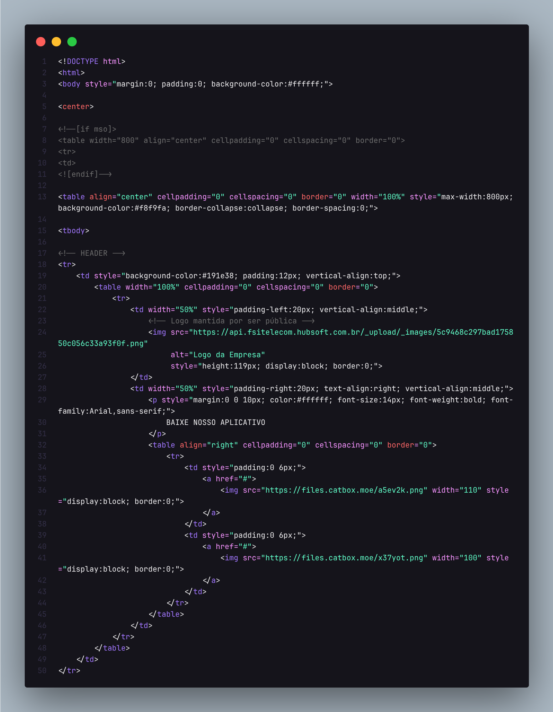

# 📧 Template de E-mail HTML – FSI Telecom

Este repositório contém um **template de e-mail em HTML** desenvolvido para uso institucional na **FSI Telecom**, com foco em **comunicação de atendimento técnico**, especialmente notificações de reparo, manutenção e políticas de cobrança.

O template foi construído seguindo boas práticas de **compatibilidade entre clientes de e-mail** (Gmail, Outlook, webmail, mobile), priorizando confiabilidade visual e fácil integração com sistemas de CRM/ISP.

---

## 🎯 Objetivo do Projeto

Padronizar e profissionalizar a comunicação com clientes, garantindo:

- Clareza nas informações técnicas
- Transparência sobre prazos e possíveis cobranças
- Identidade visual consistente da empresa
- Compatibilidade com clientes de e-mail antigos (ex: Outlook)

---

## 🛠️ Tecnologias Utilizadas

> **Plataforma de envio:** HUBsoft  
> O template foi desenvolvido especificamente para a plataforma **HUBsoft**, que **aceita exclusivamente HTML puro**, sem suporte a CSS externo, `<style>` interno ou JavaScript.

Por esse motivo, toda a construção segue rigorosamente as limitações e boas práticas exigidas pela plataforma.


Este projeto **não depende de frameworks ou bibliotecas externas**, justamente para garantir máxima compatibilidade.

### ✔️ HTML5
- Estrutura principal do e-mail
- Uso semântico básico e seguro para e-mails

### ✔️ CSS Inline
- Todo o estilo é aplicado diretamente nos elementos (`style=""`)
- Necessário para compatibilidade com clientes de e-mail que **bloqueiam CSS externo ou interno**

### ✔️ Tabelas HTML (`<table>`)
- Layout totalmente baseado em tabelas
- Padrão obrigatório para e-mails responsivos e estáveis

### ✔️ Conditional Comments (Microsoft Outlook)
```html
<!--[if mso]>
...
<![endif]-->
```
- Garante renderização correta no **Outlook (motor Word)**

---

## 📐 Layout e Estrutura

O e-mail é dividido em blocos bem definidos:

1. **Header**
   - Logo da empresa
   - Links para download do aplicativo (Google Play / App Store)

2. **Mensagem Principal**
   - Saudação personalizada
   - Informações do protocolo
   - Status do atendimento técnico

3. **Política de Atendimento Técnico**
   - Custos possíveis
   - Situações de isenção de cobrança

4. **Avisos Importantes**
   - Informações financeiras
   - Contatos de suporte e financeiro

5. **Footer**
   - Telefones
   - E-mails
   - Endereço físico
   - Link para o site oficial

<div style="display: flex; gap: 10px;">
  
  
</div>


---

## 🔁 Campos Dinâmicos

O template utiliza **placeholders**, que devem ser substituídos automaticamente pelo sistema que envia o e-mail (CRM, ERP ou sistema do provedor).

Exemplos:

```text
[[primeiro_nome_cliente]]
[[numero_ordem_servico]]
[[data_abertura]]
[[data_inicio_programado]]
```

Esses campos permitem personalização sem alterar o código HTML.

---

## 📱 Responsividade

- Largura máxima: **800px**
- Centralização automática
- Compatível com:
  - Desktop
  - Mobile
  - Webmail

> Observação: e-mails não utilizam media queries de forma confiável, por isso a responsividade é baseada em layout fluido.

---

## 📧 Compatibilidade Testada / Esperada

- Gmail (Web / Mobile)
- Outlook (Desktop e Web)
- Thunderbird
- Webmails corporativos
- iOS Mail / Android Mail

---

## 🚀 Como Usar

### Uso na plataforma HUBsoft

1. Acesse o módulo de **Comunicação / E-mails** no HUBsoft
2. Crie ou edite um modelo de e-mail
3. Cole o conteúdo do arquivo HTML diretamente no editor (modo HTML)
4. Utilize os campos dinâmicos conforme o padrão do HUBsoft
5. Salve e utilize o template nos fluxos de atendimento

---

### Uso em outras plataformas

1. Copie o conteúdo do arquivo HTML
2. Cole no editor de e-mails do seu sistema
3. Garanta que o envio aceite **HTML bruto**
4. Substitua os placeholders dinamicamente


1. Copie o conteúdo do arquivo HTML
2. Cole no editor de e-mails do seu sistema
3. Garanta que o envio aceite HTML bruto
4. Substitua os placeholders dinamicamente

---

## 🔒 Boas Práticas Aplicadas

- Compatibilidade total com o **HUBsoft**
- HTML puro (sem dependências externas)
- CSS 100% inline
- Layout baseado em tabelas
- Conditional comments para Outlook (MSO)
- Imagens externas com `display:block`
- Uso mínimo de fontes customizadas
- Estrutura limpa, organizada e comentada
- Sem JavaScript (bloqueado por clientes de e-mail e pela plataforma)


- CSS inline para compatibilidade
- Imagens externas com `display:block`
- Uso mínimo de fontes customizadas
- Estrutura limpa e comentada
- Sem JavaScript (bloqueado em e-mails)

---

## 🧑‍💻 Autor

**Felipe Maya**  
Projeto desenvolvido para uso institucional na **FSI Telecom** e publicado no GitHub para fins de portfólio e referência técnica.

---

## 📄 Licença

Este projeto pode ser reutilizado e adaptado livremente para fins educacionais ou profissionais.  
Caso utilize comercialmente, ajuste textos, identidade visual e informações legais conforme sua empresa.

## Aviso

Este template foi desenvolvido por mim durante minha atuação profissional
na empresa FSI Telecom, sendo publicado neste repositório **exclusivamente
para fins de portfólio e demonstração técnica**.

A identidade visual pertence à empresa e não representa um material oficial
ou documento institucional.


---

Se curtir ⭐ o projeto no GitHub, ajuda bastante 🙌

